# Hi, I'm Leo 

I turn ideas into products where **AI, IoT, robotics and the cloud** meet. I design the architecture
and build it end to end, from the device in the room to the model in the cloud, with
security built in from day one. Based in Spain.

### 📦 Open source
- [**aws-tree**](https://github.com/leoartco/aws-tree) — interactive map of AWS services:
  14 pillars, 100+ services, in English and Spanish.

### 🔧 Technologies & Tools
  
   
    
      
    
   
  

### 📫 Where to find me
  
